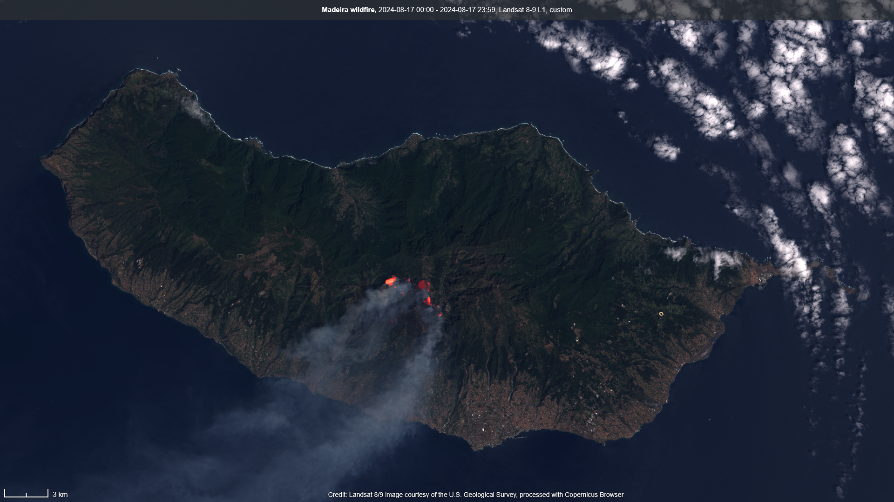

## General description

This script highlights **active fire** on Landsat 8/9 imagery by combining a true-color base with an
intensified thermal glow. This script is based on the algorithm developed for wildfire monitoring by
Pierre Markuse, enhancing the thermal signal from the Landsat thermal bands instead of the SWIR bands
of Sentinel-2 (see the original [Markuse fire script](/sentinel-2/markuse_fire) for Sentinel-2).

The visualization is built in three steps:

1. **Thermal normalization** — the thermal band **B10** is converted to a temperature in degrees
   Celsius. The script accepts B10 in different scalings: already-Celsius/Kelvin values, scaled digital
   numbers, or raw values, which are converted to brightness temperature using the Landsat TIRS
   calibration constants (`K1 = 774.8853`, `K2 = 1321.0789`).
2. **True-color base** — a slightly darkened true color image (`B04`, `B03`, `B02`) provides the
   geographic context and improves the contrast of the fire glow.
3. **Intensified fire glow** — where the temperature exceeds `minFireC` (45 °C), an additive
   red→yellow→white glow is blended onto the base. The intensity ramps up to `maxFireC` (115 °C) for the
   white-hot core. `Math.pow` curves keep the glow deep red for moderate heat and reserve yellow and
   white for the most intense pixels.

You can tune the `minFireC` and `maxFireC` thresholds at the top of the script to adjust the sensitivity
of the glow. Note this is a **per-pixel** script (Sentinel Hub evalscripts have no access to neighbouring
pixels), so it visualizes thermal anomalies but does not measure or cluster them — that kind of spatial
analysis is a downstream step.

## Description of representative images

Wildfire on the island of Madeira (Portugal), acquired 2024-08-17. The active fire fronts glow red to
white-hot over the darkened true-color terrain.

## References

- Original Sentinel-2 visualization: [Markuse fire script](/sentinel-2/markuse_fire) by Pierre Markuse
- Landsat 8 bands: [Landsat 8 collection](/landsat-8/)
- Custom scripts evalscript reference: [Evalscript V3](https://docs.sentinel-hub.com/api/latest/evalscript/v3/)
