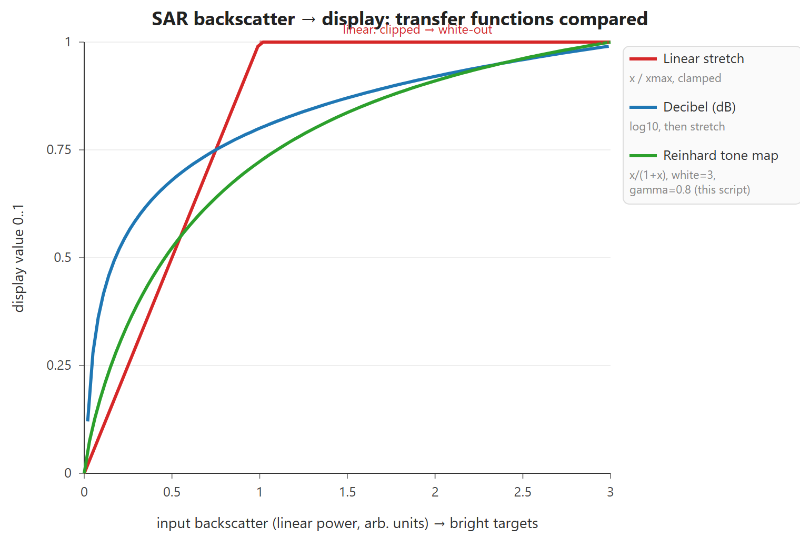
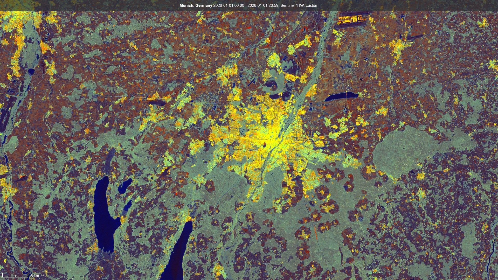

## General description

This is an enhanced version of the classic Sentinel-1 RGB ratio composite, which maps the
co-polarised backscatter to red, the cross-polarised backscatter to green, and their ratio to blue:

- **Red** &rarr; `VV`
- **Green** &rarr; `VH`
- **Blue** &rarr; `VH/VV` ratio

The standard composite applies a **linear** stretch to the raw backscatter power. Because backscatter
spans several orders of magnitude, that linear stretch spends most of the colour range on the brightest
targets: dense city centres saturate both the red and green channels and **wash out to white**, hiding
the street pattern and block structure, while vegetation never separates far enough into green. The intended use is visual interpretation of vegetation and urban structure in Sentinel-1 images or mosaics.

The enhanced script keeps the same channel mapping and the same per-channel scaling, but replaces
the linear stretch with a **tone-mapping curve** &mdash; the same idea used by the optical
[tonemapped natural color](/sentinel-2/tonemapped_natural_color) script. An extended **Reinhard** curve
**lifts the mid-range and compresses the highlights**, so bright urban areas keep their internal
structure instead of clipping to white, while the darker and mid-range surfaces gain contrast. A small
**saturation** boost makes fuller use of the colour space. The transfer is controlled by six plain
`var`s at the top of the script, adjustable directly in the Copernicus Browser / EO Browser
custom-script editor:

- **`vvGain` / `vhGain` / `ratGain`** &mdash; per-channel gain for VV (red), VH (green) and the VH/VV
  ratio (blue). Higher = brighter that channel; raise `vhGain` for greener vegetation. These set both the
  colour balance and where each channel lands on the tone curve.
- **`white`** &mdash; the tone-map white point. Raise it for more highlight headroom (bright cities stop
  blowing out); lower it for a brighter, punchier image.
- **`gamma`** &mdash; `< 1` lifts the mid-range; `1` leaves it unchanged. (Opposite effect to `white`.)
- **`saturation`** &mdash; `> 1` increases colour separation.

The figure below compares the three ways of mapping raw backscatter to a display value. The **linear**
stretch (the original composite) is a straight ramp that clips flat to 1.0, so every bright target above the
cut-off collapses to the same white and loses its internal structure. A **decibel (dB)** stretch is the
opposite extreme: it rises very steeply at the dark end, which maximises contrast but also amplifies speckle
and noise. The **Reinhard tone map** used here sits between them &mdash; it lifts the mid-range and rolls
gently toward white instead of clipping, keeping detail in both cities and vegetation:

Three versions are provided via the tabs above:

- **Full** (`script.js`) &mdash; the commented reference implementation, for `VV` + `VH` data.
- **Compact** (`min.js`) &mdash; the same output, minified with single-letter parameters
  (`g = [vvGain, vhGain, ratGain]`, `W`, `G`, `S`), small enough to embed in a Copernicus / EO Browser
  **share link**.
- **DH (HH+HV)** (`dh.js`) &mdash; for dual-pol `HH` + `HV` data, which the `VV`/`VH` scripts
  cannot read. See below.

The script is **per-pixel** (no multi-temporal loop), so it works unchanged on both **standard
Sentinel-1 GRD** acquisitions and the **Sentinel-1 monthly mosaics** &mdash; both provide linear-power
backscatter and `dataMask`. The monthly mosaics are temporally averaged and therefore much less speckled,
so for those you may want to adjust the gains and white point to recover contrast.

### The DH (HH+HV) variant

Sentinel-1 is not dual-pol `VV`+`VH` everywhere. Over the poles, sea ice and much of the open ocean it
acquires in **HH+HV** instead &mdash; in IW and EW mode alike &mdash; and the **DH monthly mosaics**
built from those acquisitions carry `HH` and `HV` bands. A band name in `setup()` is fixed at parse
time and cannot be chosen per scene, so `VV`/`VH` and `HH`/`HV` data need two separate evalscripts.
`dh.js` is otherwise line-for-line the same script:

- **Red** &rarr; `HH` (co-polarised, as `VV` is in the standard version)
- **Green** &rarr; `HV` (cross-polarised, as `VH` is)
- **Blue** &rarr; `HV/HH` ratio

The gains, tone curve and saturation carry over unchanged. They are a sensible starting point rather
than a tuned default: HH and HV backscatter differ from VV and VH over the same surface, and DH data
mostly covers ice, snow and water rather than the cities and farmland the defaults were set on. Expect
to raise or lower `hhGain` and `hvGain` for your scene.

Note on very bright red / green points in cities: these are real corner-reflector targets. Bright **red**
(high VV) is **double-bounce** from building-ground dihedrals; bright **green** (high VH) is cross-pol
from rotated dihedrals and trihedral / triple-bounce structures. Being dominant point scatterers, they
saturate regardless of the tone curve.

## Description of representative images

1. Munich (Germany)

[This scene](https://link.dataspace.copernicus.eu/1vuc) shows the Munich area in Germany. The city itself is shown in various shades of yellow, with bright red or green points highlighting specific double-bounce or triple-bounce effects. Forests (mainly south of the city) are turquoise, while croplands and grasslands are red, orange or purple. Water bodies are blue to black, and large flat surfaces such as airport runways are black to red. You can see Munich Airport in the far north, Augsburg in the northwest, and the Starnberger See and Ammersee in the southwest.

2. Canadian Arctic Archipelago &mdash; the DH variant

The two further "Evaluate and Visualize" links above open `dh.js` over the same Arctic location
(77.48&deg;N, 84.98&deg;W) on the two kinds of HH+HV data it is meant for: a single **IW HH+HV**
acquisition, and the **DH monthly mosaic** for June. Comparing the two at the same place shows the
trade-off described above &mdash; the single acquisition carries full detail with speckle, the mosaic
is temporally averaged and much smoother.

## Contributors

by András Zlinszky, Copernicus Data Space Ecosystem, [@azlinszky.bsky.social](https://bsky.app/profile/azlinszky.bsky.social)

## License

CC BY-SA 4.0 &mdash; [Creative Commons Attribution-ShareAlike 4.0 International](https://creativecommons.org/licenses/by-sa/4.0/){:target="_blank"}

## References

- Sentinel-1 dual-polarisation backscatter (VV/VH):
  [Sentinel-1 SAR User Guide](https://sentiwiki.copernicus.eu/web/s1-mission){:target="_blank"}.
- Tone-mapping approach adapted from the optical [tonemapped natural color](/sentinel-2/tonemapped_natural_color) script.
- Reinhard et al., 2002, *Photographic Tone Reproduction for Digital Images* (the Reinhard operator used here).
- Related Sentinel-1 visualisations in this repository: [SAR false color visualization](/sentinel-1/sar_false_color_visualization) and [SAR false color visualization 2](/sentinel-1/sar_false_color_visualization-2).
