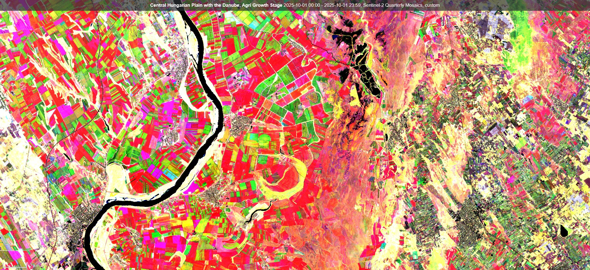

## Author of the script
[@HarelDan](https://github.com/hareldunn/GIS_Repo/blob/master/Multi-Temporal%20NDVI%20for%20Sentinel%20Hub%20Custom%20Scripts){:target="_blank"} 

Adapted to [Sentinel-2 Quarterly Cloudless Mosaics](https://documentation.dataspace.copernicus.eu/Data/SentinelMissions/Sentinel2.html#sentinel-2-level-3-quarterly-mosaics) by András Zlinszky and Github Copilot / Claude Code.

## General description of the script
Agricultural growth stage is a script visualizing the multi-temporal NDVI trends in Sentinel-2 imagery. It takes the current image as baseline and calculates the average NDVI for the previous 2 months.
The script requires multi-temporal processing, so the parameter TEMPORAL=true should be added to the request.
A simple stretching is applied to NDVI between 0.1 and 0.7 by default, then the mean NDVI from the first, second and third month is assigned to the Red, Green and Blue channels of the image respectively, creating a composite image. What you see on the composite is 
- how dense and/or vigorous the vegetation is, represented by the brightness of the color from black (no vegetation at all) to white (dense green vegetation all year), with various shades of color in between
- when the vegetation peak happens and how distinct it is. Vegetation with a single very distict peak will be one of the primary colors (Red, Green, Blue) while vegetation with a longer, more even growth season will be yellow (between Red and Green) or cyan (between Green and Blue). Purple color may indicate two vegetation peaks, one in the first month and another in the last, with a dry period or grassland mowing in between.

The adaptation for Sentinel-2 Quarterly Cloudless mosaics also visualizes multi-temporal NDVI trends in Sentinel-2 imagery, but over an even longer timeframe as each mosaic dataset covers 3 months. It uses the NDVI values from three consecutive quarterly mosaics, so it integrates information over a period of 9 months, typically a full growing season. The NDVI values are similarly stretched between 0.1 and 0.7.
Again, the color shades represent
- how dense or vigorous the vegetation is, represented by the intensity of the color (bright colors or white for dense, healthy vegetation)
- when the vegetation peak happens and how distinct it is, on a timescale of several months. 

The quarterly mosaic script uses [data fusion](/data-fusion/): the three mosaics are loaded as three separate data sources named `Q1`, `Q2` and `Q3`, each with its own date, and their NDVI values go to the Red, Green and Blue channel respectively. `Q1`, `Q2` and `Q3` are simply the first, second and third of the three quarters you select — they are not calendar quarters. For the usual April-December growing season, `Q1` is April-June, which is calendar Q2.

Loading the mosaics separately is necessary because Copernicus Browser rejects evalscript requests covering more than 180 days, and three quarterly mosaics span at least 181 days. It also makes the script simpler and more predictable than sorting a single long time range by scene date: each quarter is bound to its channel explicitly rather than inferred.

## How to use

### Sentinel-2 L2A (`script.js`)

- In Copernicus Browser, open the calendar panel dropdown (with the dropdown button on the right)
- Select the time interval view (the calendar icon with arrows on the top right). You will now see two dates, labeled "from" and "until".
- Select these dates to cover an interval of three months. Selecting eg. June 1 to August 31 will cover most of the agriculture growth season.
- Select your evalscript of choice from this script website and copy it from the code window above
- In Copernicus Browser, click the `</>` icon beside the name of the active layer to open the evalscript code window
- Select the full text inside the window (eg. with the Ctrl+A hotkey) and paste the evalscript code from the clipboard
- Wait until the data loads - this may take some time for large areas.

### Sentinel-2 Quarterly Mosaics (`quarterly_mosaics.js`)

This script uses data fusion, so instead of one time range you configure three data sources, one per quarter. The mosaic you select at the start counts as the first of the three, so you only add the collection twice more.

- In Copernicus Browser, zoom to your area of interest and select `Sentinel-2 Quarterly Mosaics`. Choose the mosaic image date at the start of the time range you are interested in - this becomes `Q1`, the oldest quarter.
- Click the `</>` icon beside the name of the active layer to open the custom script panel, click the radio button for `Custom script` and tick `Use additional datasets (advanced)`
- Add the Sentinel-2 Quarterly Mosaics collection **two times**, for the two later quarters. For the collection id, paste the bare UUID `5460de54-082e-473a-b6ea-d5cbe3c17cca`. Do **not** paste the full `byoc-5460de54-...` identifier shown in the [collection documentation](https://documentation.dataspace.copernicus.eu/Data/SentinelMissions/Sentinel2.html) - the field prepends `byoc-` on its own, and the doubled prefix makes the request fail with a blank layer and no error message.
- Name the three data sources `Q1`, `Q2` and `Q3`, oldest to most recent, including the mosaic you selected at the start. These names must match the `datasource` names in the script.
- For the two added data sources, tick `Customize timespan` and set it to the first day of the quarter you want in that channel. The date of a Quarterly Mosaic refers to the first day of the 3 month interval the data comes from ([details](https://forum.dataspace.copernicus.eu/t/scenes-getmonth-for-quarterly-mosaics/3045/2?u=andras.zlinszky_education)). For the April-December growing season, set `Q1` to 2025-04-01, `Q2` to 2025-07-01 and `Q3` to 2025-10-01.
- Copy the script from the code window above, select the full text in the evalscript window (eg. with Ctrl+A) and paste it
- Click `Refresh evalscript` and wait until the data loads

## Description of representative images
The Agricultural growth stage script applied to the agricultural fields of Italy (Veneto). 

The quarterly mosaic script applied to the central region of the Great Hungarian Plain, using the April, July and October 2025 mosaics. Böddi-szék lake is the black area in the north, and the patch structure of the surrounding grassland visible in various shades of red. The town of Paks shown in black in the southwest, and the vineyards around Kiskőrös are visible as small parcels in various shades of green in the southeast. The Danube runs through the western half of the scene as a black band. Red fields peaked in April-June, green fields in July-September and blue fields in October-December, while yellow marks a long peak spanning the first two quarters and white marks vegetation that stayed dense all year.

## References
Based on: 
[source 1](https://twitter.com/sentinel_hub/status/922813457145221121){:target="_blank"}, 
[source 2](https://twitter.com/sentinel_hub/status/1020755996359225344){:target="_blank"}

