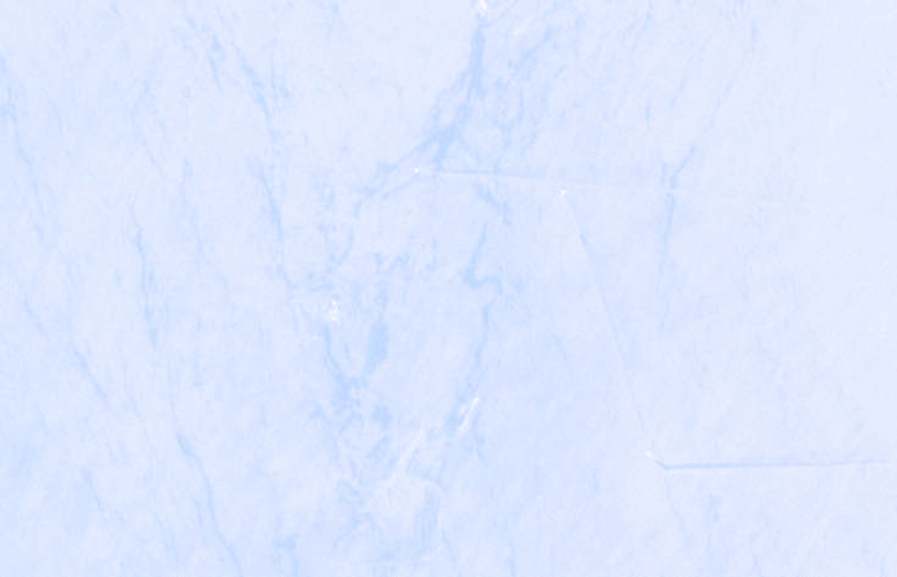

## General description

This script highlights **ships** on the open sea in Sentinel-2 L2A optical imagery, and is a
quick-look / spotting tool for the Copernicus Browser. It is especially useful for fishing
vessels: alongside the hulls it brings out their **wakes** and - when a purse-seine set is in
progress - the thin curved **net floatline** arc a seiner pays out around a school.

Vessels are picked out with a simple per-pixel test: over open water the near-infrared (B08) and
short-wave infrared (B11/B12) reflectances are very low, while a hull is comparatively bright in
those bands, so a pixel is flagged as a likely vessel when

```
B08 > SHIP_T_NIR  OR  B11 > SHIP_T_SWIR  OR  B12 > SHIP_T_SWIR
```

A gamma-stretched true-color base (`WATER_MAX`, `GAMMA`) brings out wakes, slicks and the sunglint
texture in which floatline arcs are visible.

The script has four modes (set `MODE` at the top):

- `MODE = 0` - **Enhanced true color**: wakes, slicks and sunglint texture.
- `MODE = 1` - **Vessel highlighter** (default): likely hulls flagged red on a dimmed base.
- `MODE = 2` - **NIR/SWIR false color**: hulls glow, water goes black.
- `MODE = 3` - **Glint-stretch (mono)**: maximum surface texture for nets and wakes.

**Tuning:** sunglint varies strongly between scenes, so raise `SHIP_T_NIR` / `SHIP_T_SWIR` over
bright, glinty water and lower them over calm, dark water. Note this is a *per-pixel* script
(Sentinel Hub evalscripts have no access to neighbouring pixels), so it spots candidates but does
not measure or filter them by cluster size - that kind of spatial analysis is a downstream step.

## Description of representative images

Fishing vessels (tuna purse seiners) working SE of Lampedusa (Strait of Sicily) during the
bluefin season; vessels flagged red with `MODE = 1`. Acquired 2026-06-02.



## References

- Sentinel-2 bands: [Sentinel-2 L2A documentation](https://docs.sentinel-hub.com/api/latest/data/sentinel-2-l2a/)
- Custom scripts evalscript reference: [Evalscript V3](https://docs.sentinel-hub.com/api/latest/evalscript/v3/)
